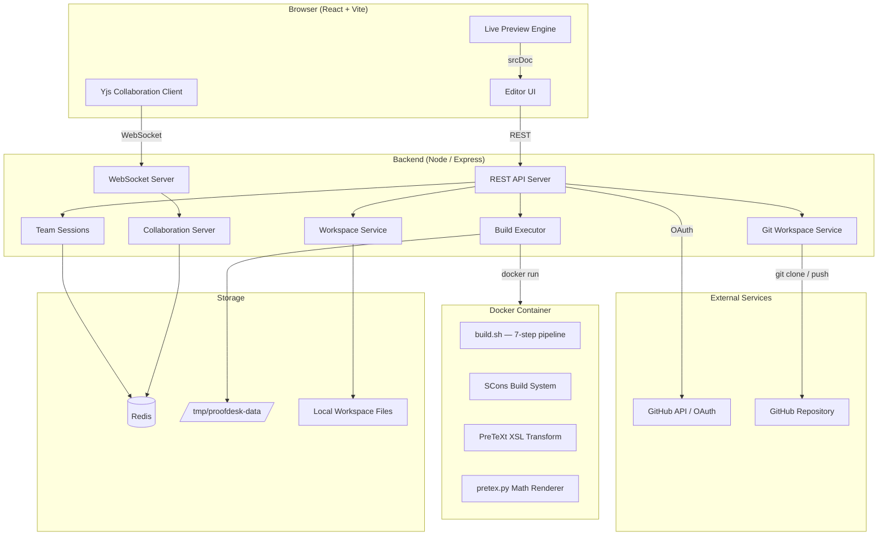
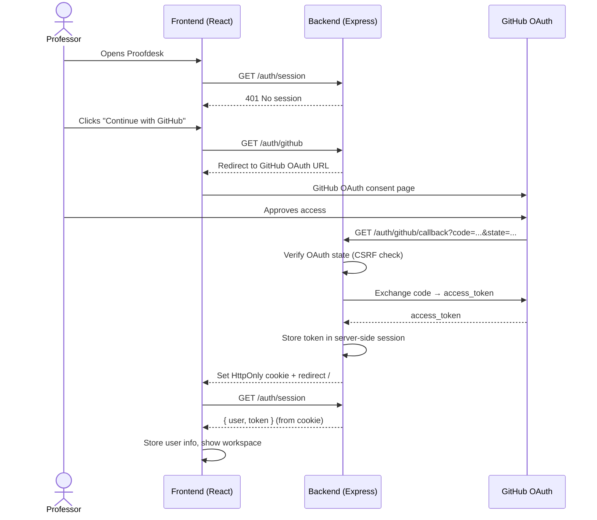
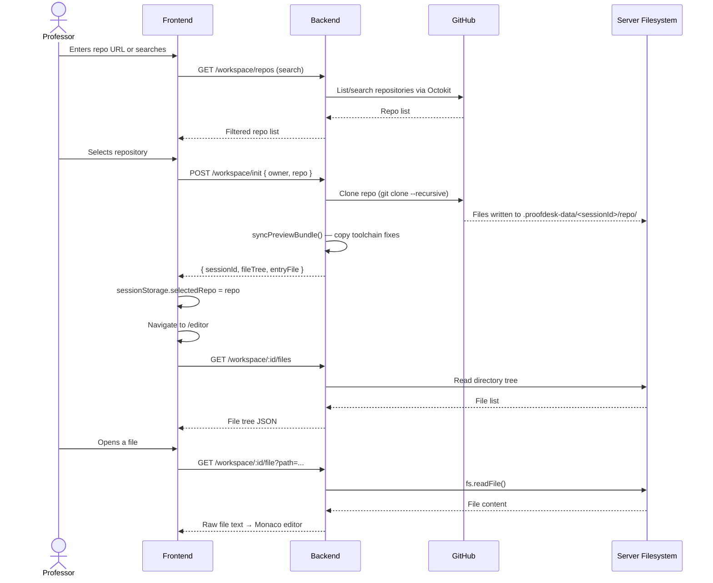
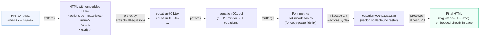
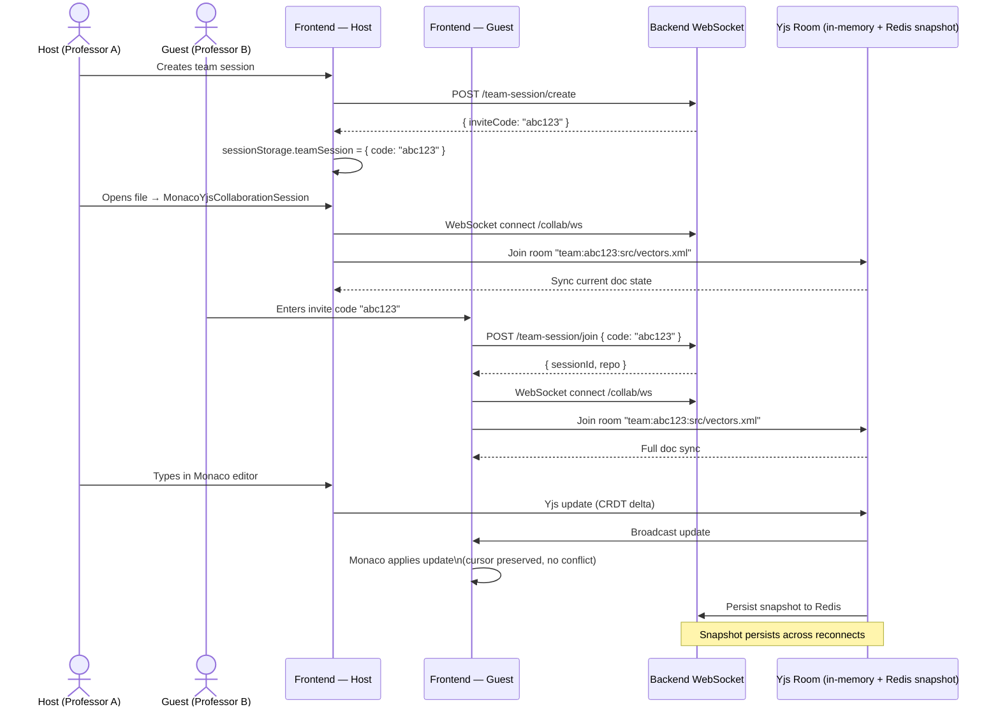
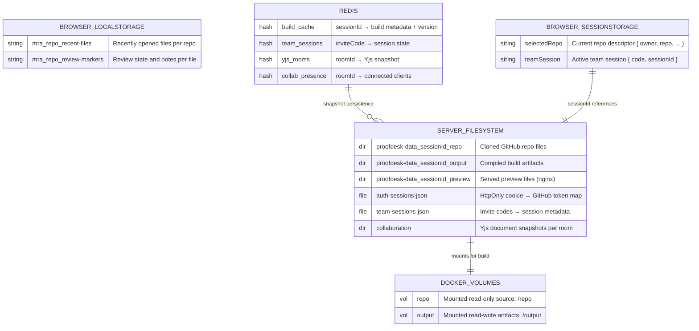
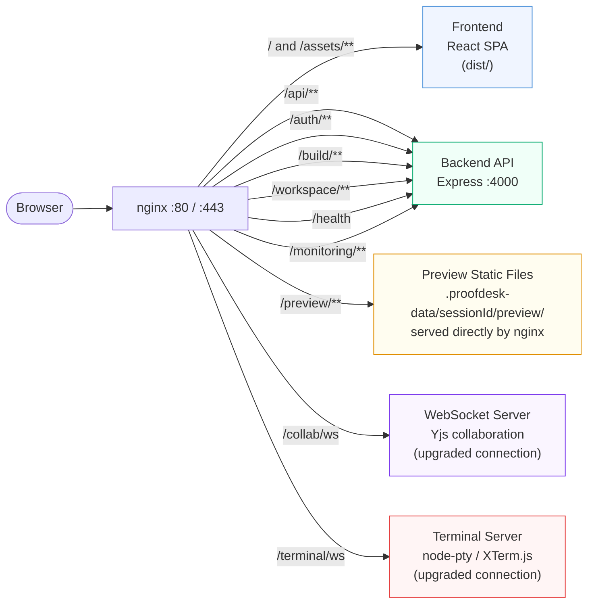
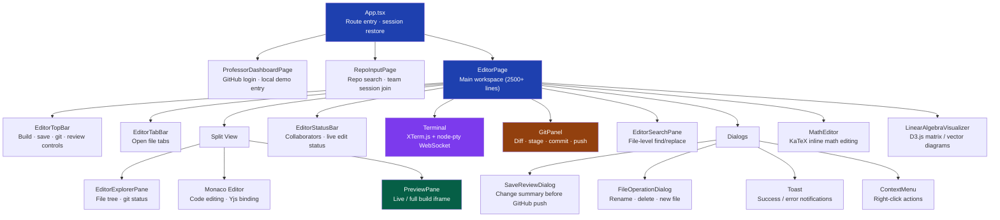

# Proofdesk — System Design

> **Author / Contributor:** Harsha Raj Kumar
> **Stack:** React · TypeScript · Node.js · Express · Docker · PreTeXt · Yjs · Redis · nginx

---

## Table of Contents

1. [High-Level Architecture](#1-high-level-architecture)
2. [Authentication Flow](#2-authentication-flow)
3. [Repository & Workspace Initialization](#3-repository--workspace-initialization)
4. [Full Build Compilation Pipeline](#4-full-build-compilation-pipeline)
5. [Math Rendering Pipeline](#5-math-rendering-pipeline)
6. [Live vs Full Preview Modes](#6-live-vs-full-preview-modes)
7. [Real-Time Collaboration (Yjs)](#7-real-time-collaboration-yjs)
8. [Storage Model](#8-storage-model)
9. [Request Routing (nginx)](#9-request-routing-nginx)
10. [Frontend Component Hierarchy](#10-frontend-component-hierarchy)

---

## 1. High-Level Architecture

---

## 2. Authentication Flow

---

## 3. Repository & Workspace Initialization

---

## 4. Full Build Compilation Pipeline

```mermaid
flowchart TD
    A([Professor clicks\nBuild Repository]) --> B

    subgraph BE["Backend — buildExecutor.js"]
        B[POST /build/init received]
        B --> C[Generate sessionId]
        C --> D[git clone GitHub repo\ninto /tmp/proofdesk-data/sessionId/repo]
        D --> E[Inject toolchain fixes\nPython 3 patches · Inkscape 1.x patches]
        E --> F{Docker image\nmra-pretext-builder\nexists?}
        F -- No --> G[docker build -t mra-pretext-builder ./docker]
        G --> H
        F -- Yes --> H[docker run --rm\n-v repo → /repo\n-v output → /output\nmra-pretext-builder]
    end

    subgraph DC["Docker Container — build.sh"]
        H --> S1

        S1["Step 1 · Git Submodules\nmathbook · mathbook-assets · mathbox"]
        S1 --> S2["Step 2 · Ruby 3.2 Patch\nFile.exists? → File.exist?"]
        S2 --> S3["Step 3 · Build Submodule Assets\nSCSS → CSS via sass-embedded\nnpm + gulp → MathBox JS bundle"]
        S3 --> S4["Step 4 · Python 3 Patches\naglfn.py · processtex.py · SConscript"]
        S4 --> S5A

        subgraph SCons["Step 5 · SCons Build"]
            S5A["scons\nJS/CSS bundles\n31 interactive demo HTML pages"]
            S5A --> S5B["scons html\nPreTeXt XML → HTML chapters"]
            S5B --> XSL["xsltproc + PreTeXt XSL\ntransforms src/*.xml → HTML"]
            XSL --> MATH["pretex.py extracts LaTeX\npdflatex → inkscape → inline SVG"]
        end

        MATH --> S6["Step 6 · Copy to /output\nHTML · CSS · JS · fonts\nknowl/ · demos/ · pretex-cache/"]
        S6 --> S7["Step 7 · Validate output\nFind overview.html / index.html"]
    end

    S7 --> I

    subgraph BE2["Backend — post-build"]
        I[Collect artifact list from output/]
        I --> J[syncPreviewBundle to preview/]
        J --> K[Cache build result in Redis]
        K --> L[Return sessionId + entryFile]
    end

    L --> M([PreviewPane renders\niframe src=/preview/sessionId/index.html])
```

---

## 5. Math Rendering Pipeline

---

## 6. Live vs Full Preview Modes

```mermaid
flowchart TD
    Edit([Professor edits file]) --> FT{File type?}

    FT -->|.html / .htm| LiveHTML
    FT -->|.ptx / .xml\nPreTeXt| LiveXML
    FT -->|.css / .js| QuickUpdate
    FT -->|other| FullRebuild

    subgraph LiveHTML["Live HTML Mode (instant, no backend)"]
        LH1[prepareHtmlForSrcDoc\nrewrite relative URLs + inject MathJax]
        LH1 --> LH2[setSrcDocContent → iframe srcDoc=...]
        LH2 --> LH3[Browser renders HTML immediately]
        LH3 --> LH4[POST /build/quick-update\nbehind the scenes]
    end

    subgraph LiveXML["Live PreTeXt Mode (client-side transform)"]
        LX1[pretexToHtml\nbrowser-side XML → HTML converter]
        LX1 --> LX2[Converts theorems · equations · lists\nMathJax renders math in iframe]
        LX2 --> LX3[setSrcDocContent → iframe srcDoc=...]
        LX3 --> LX4[setTimeout → enqueue full Docker rebuild]
    end

    subgraph QuickUpdate["Quick Update (asset patch only)"]
        QU1[POST /build/quick-update\nfile content only]
        QU1 --> QU2[Backend writes file to output/\nno Docker, no re-render]
        QU2 --> QU3[previewFrameKey++ → iframe reload]
    end

    subgraph FullRebuild["Full Docker Rebuild"]
        FR1[POST /build/init or /build/update]
        FR1 --> FR2[Docker pipeline runs\n15–20 min first build\n2–5 min incremental]
        FR2 --> FR3[setPreviewUrl → iframe src=/preview/...]
    end

    style LiveHTML fill:#f0fff8,stroke:#00a86b
    style LiveXML fill:#f0f5ff,stroke:#4a90d9
    style QuickUpdate fill:#fffdf0,stroke:#e08e00
    style FullRebuild fill:#faf5ff,stroke:#7c3aed
```

---

## 7. Real-Time Collaboration (Yjs)

---

## 8. Storage Model

---

## 9. Request Routing (nginx)

---

## 10. Frontend Component Hierarchy

---

## Build Time Reference

| Phase | Tool | Typical Duration |
|---|---|---|
| Docker image build (first time) | `docker build` | 15–20 min |
| Git submodule init | `git submodule update` | 30–60 s |
| SCSS → CSS | `sass-embedded` | 5–10 s |
| MathBox JS bundle | `npm + gulp` | 30–60 s |
| SCons JS/CSS + 31 demos | `scons` | 2–5 min |
| PreTeXt XML → HTML | `xsltproc` | 1–2 min |
| Math SVG render (500+ equations) | `pdflatex + inkscape` | 8–15 min |
| Incremental rebuild (cached math) | SCons + pretex-cache | 2–4 min |
| Live XML preview (browser) | `pretexToHtml()` | < 100 ms |
| Live HTML preview (browser) | `prepareHtmlForSrcDoc()` | < 50 ms |

---

*Designed and built by **Harsha Raj Kumar**.*
